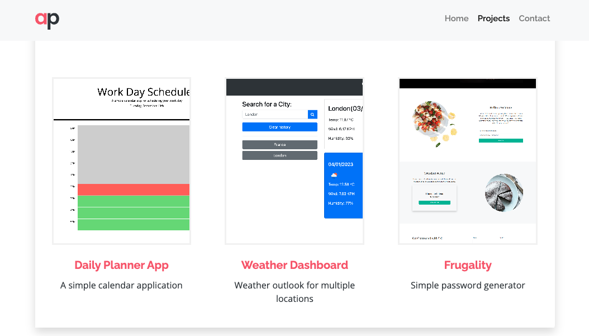

# React Portfolio

[](https://opensource.org/licenses/MIT)

## Description

Personal Portfolio using React.

[Application Demo](https://react-portfolio-dgnygsz9z-celiyo.vercel.app/)



## Table of Contents

- [Installation](#installation)
- [Usage](#usage)
- [Tests](#tests)
- [Contributing](#contributing)
- [License](#license)

## Installation

To install the necessary dependencies, run the following command:

```
npm i
```

## Usage

To start the app, run the following command:

```
npm start
```

## Tests

The following command can be run for testing:

```
npm run test
```

## Contributing

Contributions, issues and feature requests are welcome. Browse the source repository of this article and open a pull request. I will do my best to review your proposal in due time.

## License

This project is licensed under the [MIT License](LICENSE).
